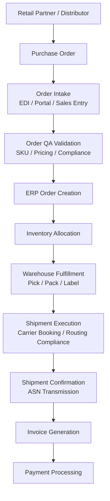

# Wholesale Order Lifecycle Flow

```mermaid
flowchart TD
A[Retail Partner / Distributor] --> B[Purchase Order]
B --> C[Order Intake<br>EDI / Portal / Sales Entry]
C --> D[Order QA Validation<br>SKU / Pricing / Compliance]
D --> E[ERP Order Creation]
E --> F[Inventory Allocation]
F --> G[Warehouse Fulfillment<br>Pick / Pack / Label]
G --> H[Shipment Execution<br>Carrier Booking / Routing Compliance]
H --> I[Shipment Confirmation<br>ASN Transmission]
I --> J[Invoice Generation]
J --> K[Payment Processing]
```
