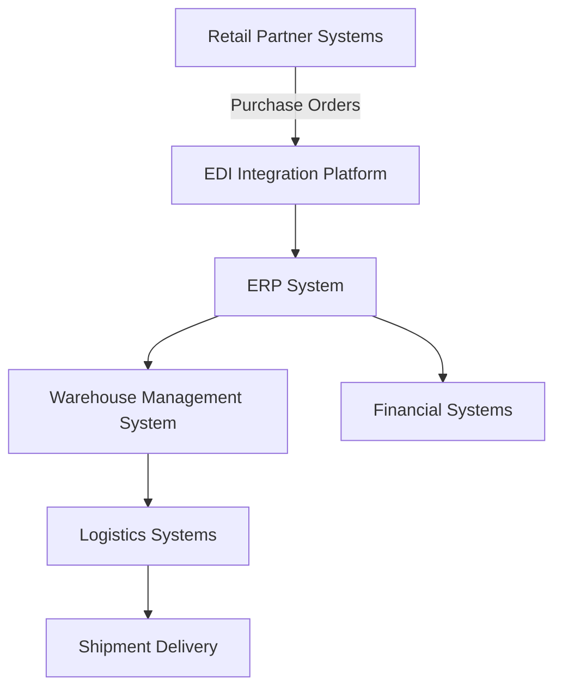

# Wholesale System Architecture

Wholesale operations depend on multiple integrated systems that support order processing, inventory management, logistics coordination, and financial transactions.

The following architecture illustrates how operational data flows between systems.

